# Developing for GeoNode on Windows with VirtualBox and PyCharm CE

This folder contains information about the GeoNode Summit 2020 workshop 'Developing for GeoNode on Windows with VirtualBox and PyCharm CE'. As part of this workshop you will install and configure VirtualBox and PyCharm CE to have a working development environment inside an Ubuntu 20.04 LTS Desktop VM ontop a Windows 10 host.

## Prerequisites

Before you can follow the below instructions, you should download and install Oracle VirtualBox:

https://www.virtualbox.org/wiki/Downloads

To install Ubuntu as VM OS you have to download its image file. Please use the Desktop Image version:

https://releases.ubuntu.com/20.04/

## Create VM

Create a new VM according to these screenshots:

Choose Ubuntu 64bit with enough RAM:
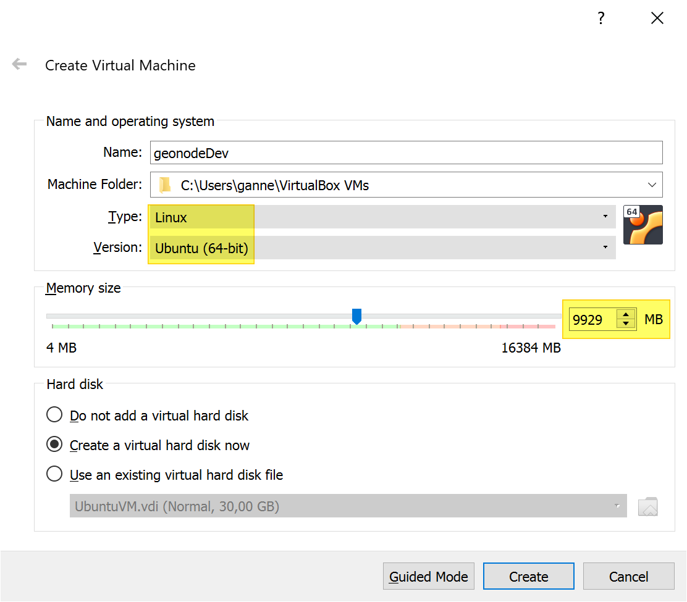

Set the hdd to around 25gb:
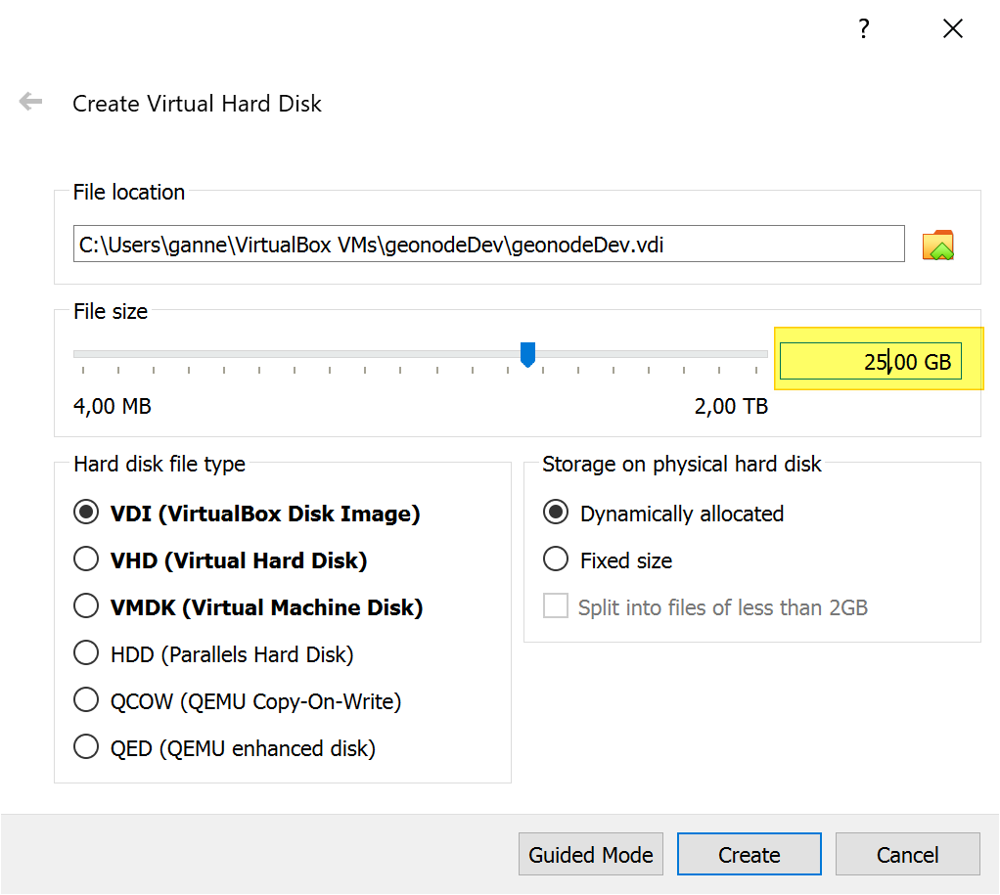

Alter the settings to get better performance:


Give the VM enough CPU cores:
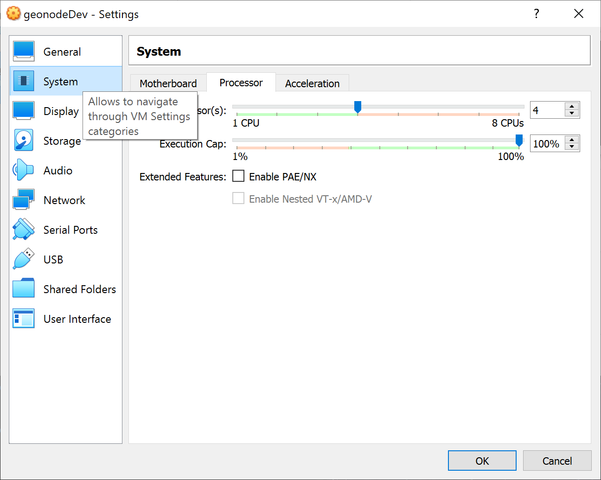

provide gpu memory to render the desktop faster:
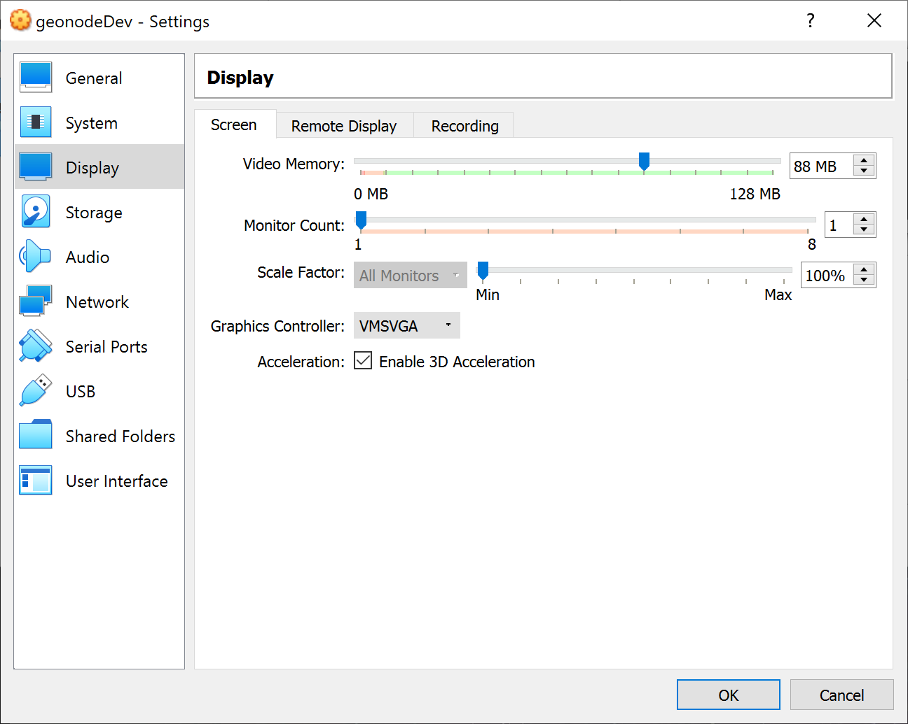

insert ubuntu.iso into disc drive and start the machine. The Ubuntu install should boot up.

## Install Ubuntu Desktop

Install ubuntu according to your hosts preferences (eg. keyboard layout, timezone, passwords). This document is using
the following credentials:

username: `geonode`
password: `geonode`

A minimal installation will be enough. **You must pick a password** to enable proper remote sessions. Consult the 
ubuntu documentation for anything which is unclear.

To enable proper fullscreen mode, do alter the settings and switch VirtualBox´s rendermode:
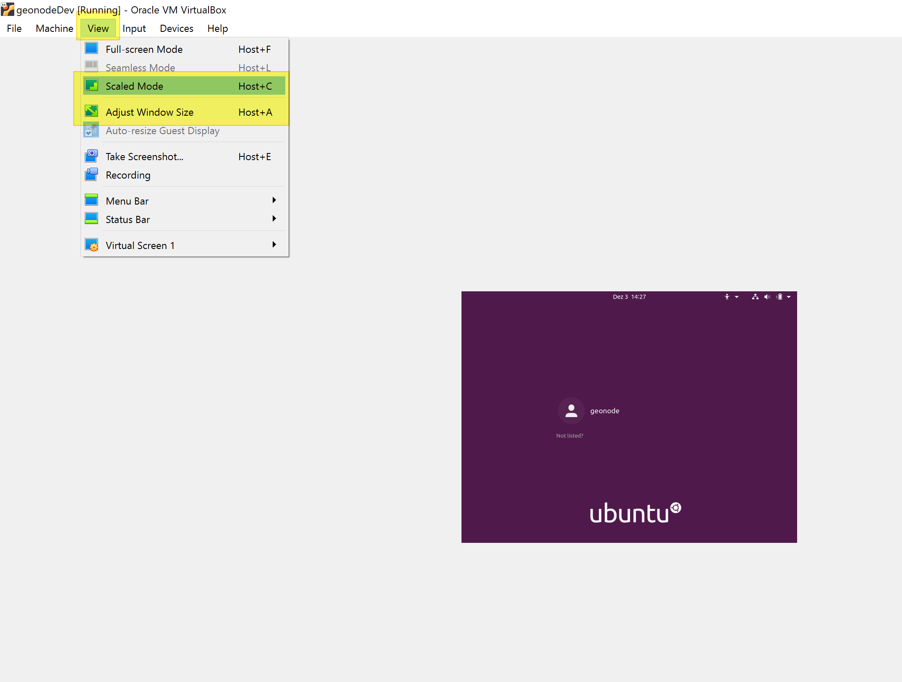

and change resolution in Ubuntu:
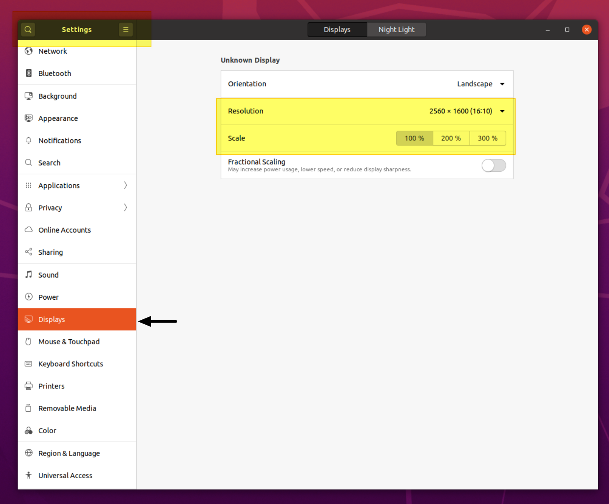

open the terminal to install git.
````shell script
sudo apt install git
````

Now the Ubuntu Desktop VM is ready to use for general purpose Ubuntu development. You can do a snapshot of this state 
for later reference (see virtual box documentation).

## Install GeoNode prerequisites

To run GeoNode in development mode you have to install **some** of its prerequisites (as stated 
[here](https://docs.geonode.org/en/3.x/install/advanced/core/index.html#ubuntu-20-04lts)). Since PyCharm will take care
of the virtual environment our setup is _a bit more lean_ than the officially stated. 

_Please use the shell commands one at a time to be sure they will be executed_

See:

````shell script
sudo add-apt-repository ppa:ubuntugis/ppa
sudo apt update -y; sudo apt upgrade -y;

# Install packages from GeoNode core
sudo apt install -y build-essential gdal-bin \
    python3.8-dev python3.8-venv virtualenvwrapper \
    libxml2 libxml2-dev gettext \
    libxslt1-dev libjpeg-dev libpng-dev libpq-dev libgdal-dev \
    software-properties-common build-essential \
    git unzip gcc zlib1g-dev libgeos-dev libproj-dev \
    sqlite3 spatialite-bin libsqlite3-mod-spatialite libsqlite3-dev

# Install Openjdk
## we will use this to run GeoServer alongside GeoNode
sudo apt install openjdk-8-jdk-headless default-jdk-headless -y
sudo update-java-alternatives --jre-headless --jre --set java-1.8.0-openjdk-amd64

# Verify GDAL version
gdalinfo --version
  $> GDAL 3.0.4, released 2020/01/28

# Verify Python version
python3.8 --version
  $> Python 3.8.5


# Verify Java version
java -version
  $> openjdk version "1.8.0_265"
  $> OpenJDK Runtime Environment (build 1.8.0_265-8u265-b01-0ubuntu2~20.04-b01)
  $> OpenJDK 64-Bit Server VM (build 25.265-b01, mixed mode)
````

The other parts (virtual env, repository cloning, ...) of the setup are not needed for us since PyCharm will cover those.

## Install PycharmCE and GeoNode packages

To install PyCharm CE you can use the Ubuntu AppStore and search for it (under development):


After installing PyCharm you can start it. To start a new project we will clone GeoNode from VCS (github).

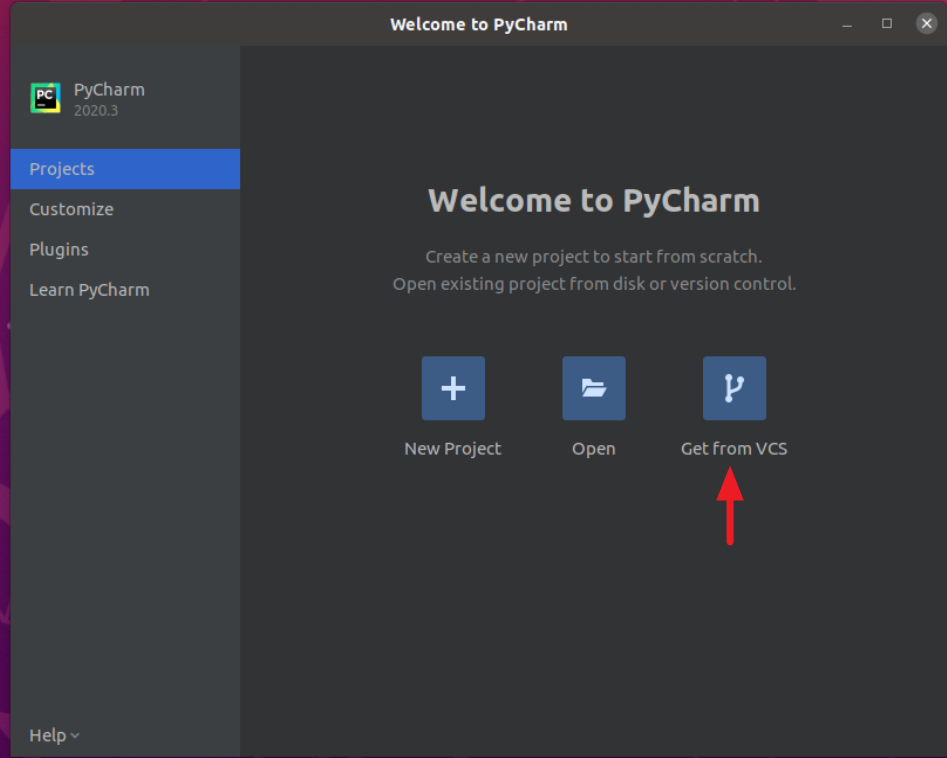

and use the https link for cloning the repository: ``https://github.com/GeoNode/geonode.git``

You can later connect your github account with PyCharm and fork the
GeoNode main repository.


This will clone the repository into our PyCharm projects folder and open it. After the cloning process is
done PyCharm will create a virtual environment for you and does recognize the `requirements.txt` file


It will install the packages as shown automatically and provide the interpreter:


open PyCharms integrated terminal and verify the usage of the virtual env:

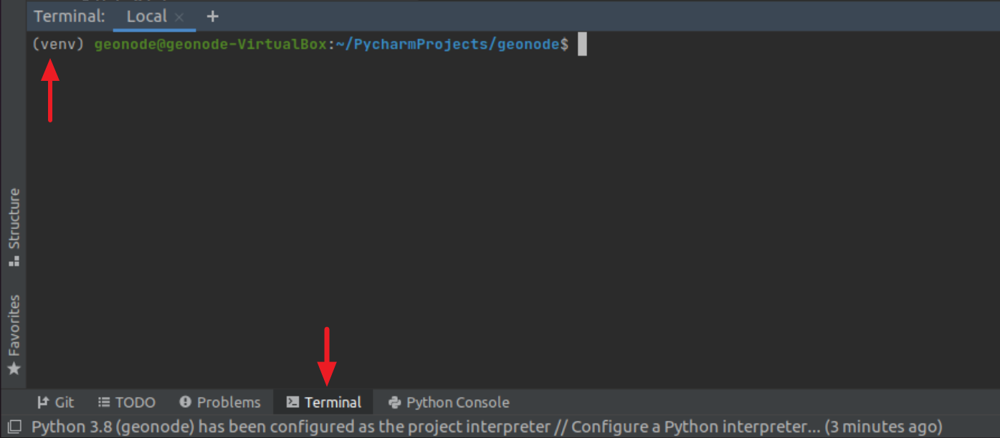

We will update the packages and install GeoNode and pygdal via the integrated terminal and with activated virtual env.
Use these commands inside the terminal (most packages should be up-to-date):

````shell script
# install packages 
pip install -r requirements.txt --upgrade --no-cache --no-cache-dir
# and GeoNode itself
pip install -e . --upgrade
# and fitting pygdal version
pip install pygdal=="`gdal-config --version`.*"
````

## Prepare the debug environment
After having the appropriate packages installed, we can start to use the GeoNode `paver` commands to help us setup the
dev environment. You can use the already opened PyCharm terminal to invoke paver by:
````shell script
# download geoserver and jetty and other needed stuff
paver setup
````
GeoNode does need a preconfigured database to run. We can create one by installing fixtures and apply migrations. There
are Django commands to do so, but since we have paver we can just call:
````shell script
# create dev database with initial data
paver sync
````
You will see how various migrations and fixtures are applied to our development database (spatiallite). 

We can use paver for many different commands ( run `paver help` to see a list of them). To start GeoServer we can use:
````shell script
# get geoserver running
paver start_geoserver
````

You should see output from jetty which starts geoserver. There will be several warnings.

**We intentionally will not start GeoNode over paver**. To enable PyCharm debugging we will use a debug configuration 
instead and run it. Open the dialog:


And create a new configuration from the python template:


Fill the values as follows:

script path: The path to the ``manage.py`` file inside your project. See below for example.

parameters: ``runserver localhost:8000`` this will start the Django dev server on the given port and location.

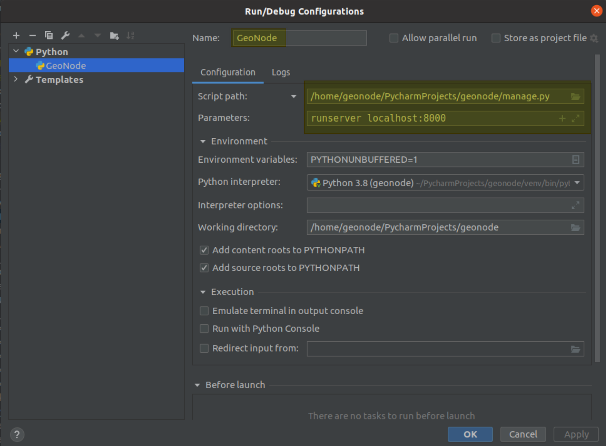
accept the values.

## Start debug environment

You can now run GeoNode in debug mode:


 
You will see some django output in the debug area:

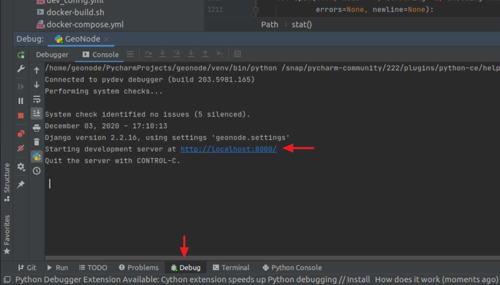

pause the execution to get into the python shell to do a quick sanity check:


Use the following python code to check if the database is running as expected:
````python
from django.contrib.auth import get_user_model
User = get_user_model()
User.objects.all()
```` 
 
You should get output like this:

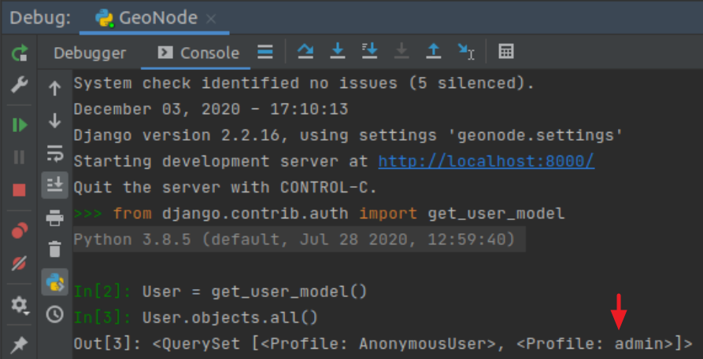

We see two User objects are present in the django database. The interactive shell will enable code completion and other 
common IDE features.

resume the application and lets test the web application.

## Test GeoNodes funtionality

You can open GeoNode with your browser at `localhost:8000`. By doing this you will see the default GeoNode homepage:

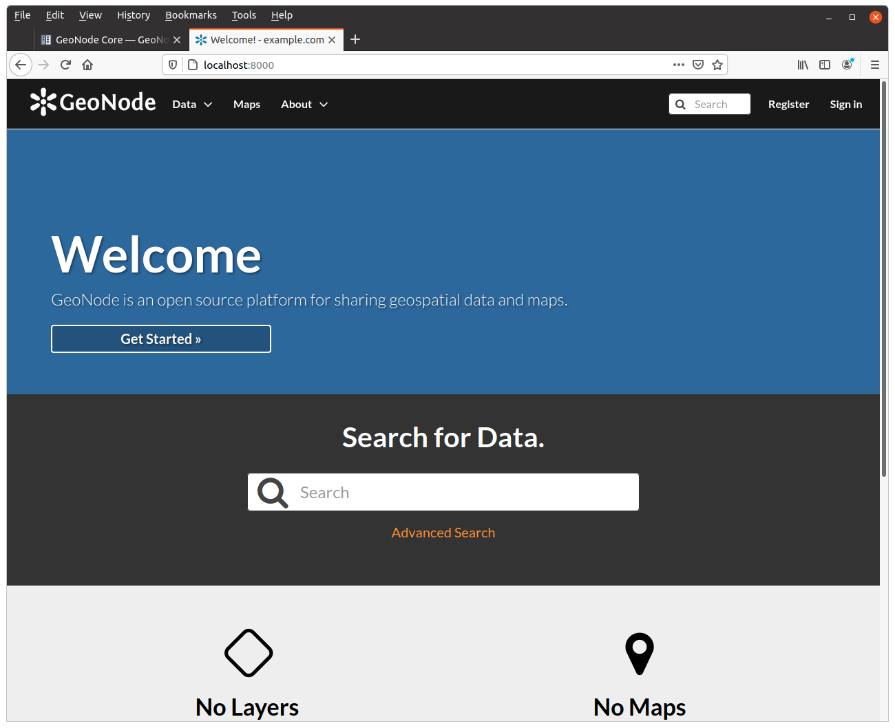

You can login with the credentials:

user: `admin`, password: `admin`

To check if GeoServer is running and is properly connected with GeoNode we can open it in the superuser menu:

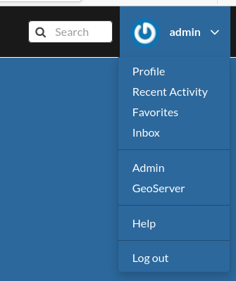

if you choose GeoServer the browser will open your local GeoServer which is running in a jetty container. To test the 
GeoNode to GeoServer coupling (via OAuth) you can use the little GeoNode icon next to the standart login buttons:


By clicking it you should get authenticated as GeoServer superuser.

We could test more of GeoNodes functionality, like creating a new user and uploading files, but we want to get debugging
working! A tool you will often use is to set breakpoints. Let me show you how that works.

## Breaking into the code

Let´s say we want to see how the code behaves on uploading a shapefile with iso-metadata xml. We will start by opening 
the file `geonode/layers/metadata.py`:

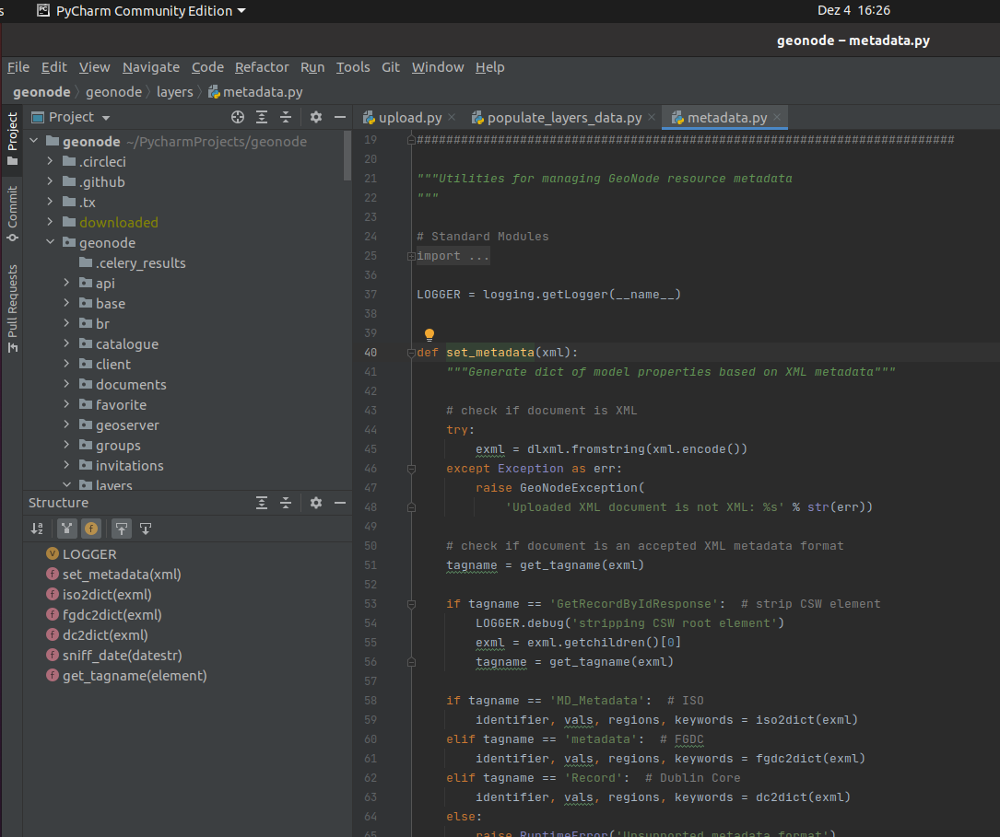

This looks promising. To see where the `set_metadata(xml)` function is called we can find its usages. Do so by right 
clicking on the function and choosing 'find usages' (_ALT+SHIFT+7_) in the menu.

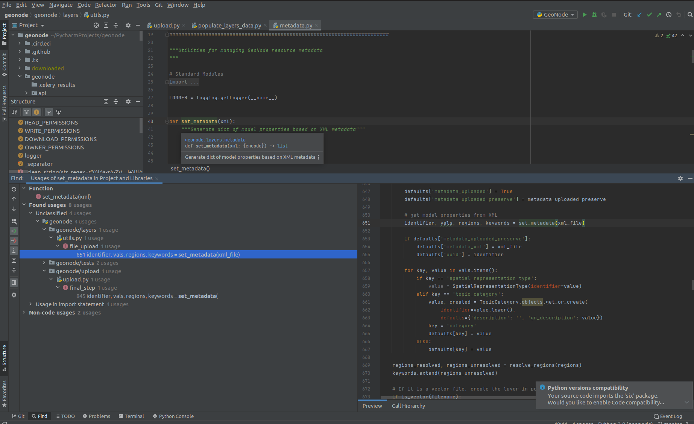

As you can see it is actually used in the `utils.py` file inside the `file_upload()` function on line 651. Let us break into the execution of `set_metadata()` at line 51 of the currently open `metadata.py`. You can do so by
clicking right next to the line number:

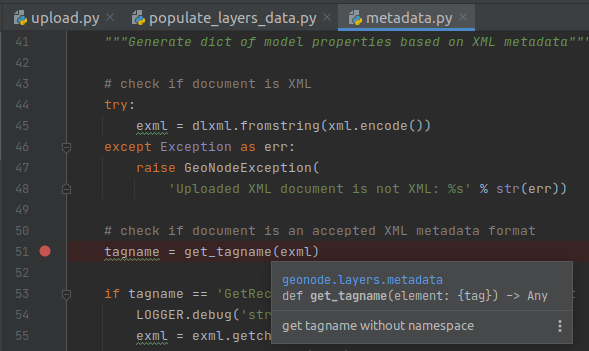

Now we need something to upload with XML metadata. We will use a test dataset inside this repository and clone it to our
dev VM. Open the terminal (eg. in PyCharm):

```shell
# switch to home directory
cd ~
# clone this repo
git clone https://github.com/gannebamm/geonode-workshop
# check the data content
ll geonode-workshop/00_getStarted/data
```
example output:
```shell
geonode@geonode-VirtualBox:~$ ll geonode-workshop/00_getStarted/data
total 2012
drwxrwxr-x 2 geonode geonode    4096 Dez  4 17:28 ./
drwxrwxr-x 4 geonode geonode    4096 Dez  4 17:28 ../
-rw-rw-r-- 1 geonode geonode       5 Dez  4 17:28 winterCrangonSurvey.cpg
-rw-rw-r-- 1 geonode geonode 1933688 Dez  4 17:28 winterCrangonSurvey.dbf
-rw-rw-r-- 1 geonode geonode     143 Dez  4 17:28 winterCrangonSurvey.prj
-rw-rw-r-- 1 geonode geonode     257 Dez  4 17:28 winterCrangonSurvey.qpj
-rw-rw-r-- 1 geonode geonode   51116 Dez  4 17:28 winterCrangonSurvey.shp
-rw-rw-r-- 1 geonode geonode   14676 Dez  4 17:28 winterCrangonSurvey.shx
-rw-rw-r-- 1 geonode geonode   29584 Dez  4 17:28 winterCrangonSurvey.xml
```

lets use this files to test our breakpoint. Switch to your browser and open the GeoNode site. Check if you are loged in 
as admin and upload the files above:

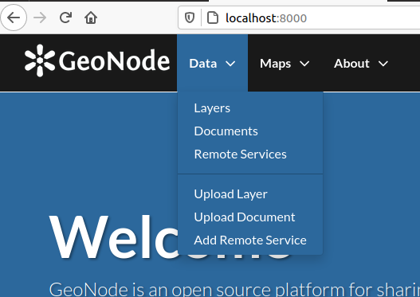

you will find them here:


After clicking the red upload button PyCharm will break in and show you the current execution trace and variables:

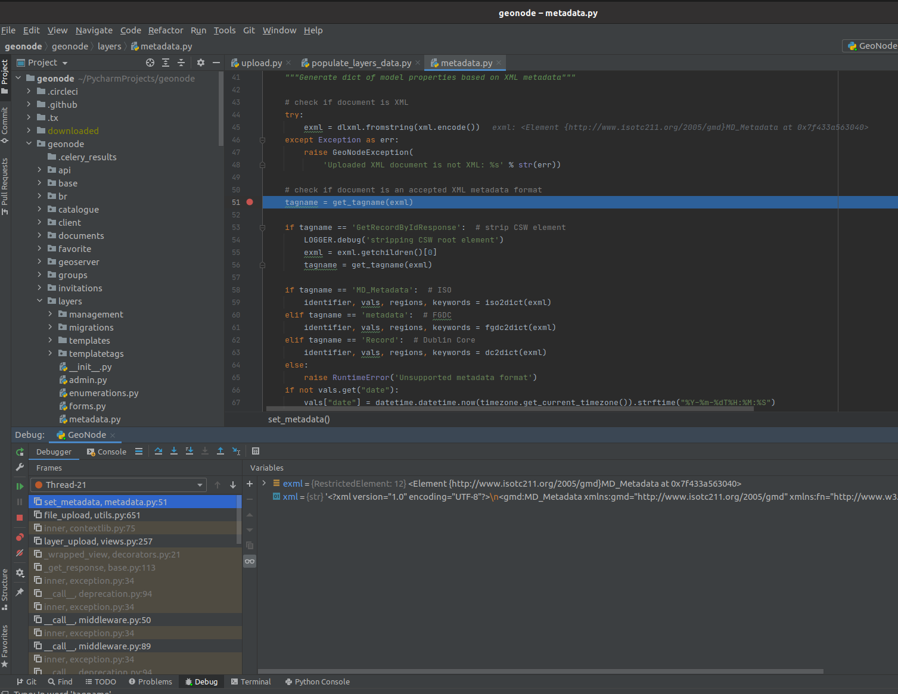

We can use step-over (`F8`) to step over the next steps. Do so twice to stop right before the tagname will be evaluated:


We see the evaluation will execute a function `iso2dict()` on line 59. We want to follow this execution and therefore 
switch to `stepping into` (`F7`) which will let us debug into the function execution. See:

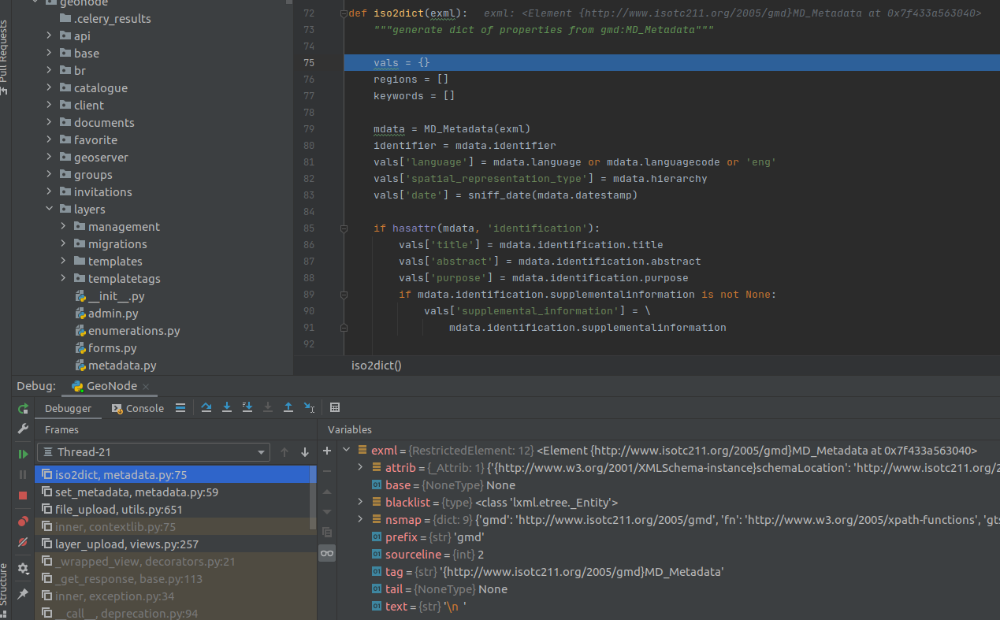

Ok. We have learned how to get a debuggable development VM running on a Windows host. We also learned some of the 
IDE features PyCharm CE does provide. There is much more to learn and I encourage you to read or watch some tutorial
material. But that is outside this workshops scope.

**Little Sidenote: The above debuged request did time-out! Keep that in mind if you debug GeoNode to GeoServer 
communication**

So, what is left for us to do is finish this workshop.

## Stop GeoNode and GeoServer

You can stop the debug server with PyCharms integrated tools. 


But in addition you should stop GeoServer, too! I oftentimes left that one running an was puzzled why the 8080 port was
blocked. to accomplish this use ``paver stop_geoserver`` in the PyCharm terminal (make sure you have the virtual env 
running). This will stop jetty and GeoServer.

And now, we are finished.
